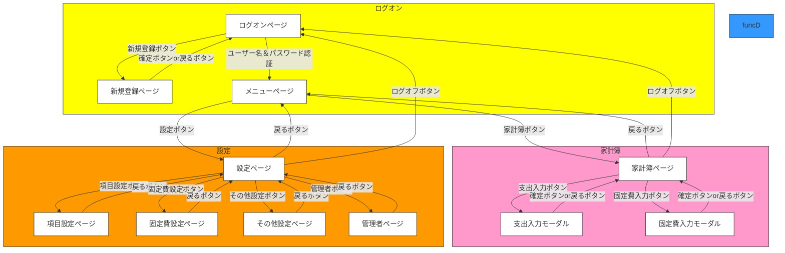

```mermaid

graph TD

    classDef default fill: #fff,stroke: #333,stroke-width: 1px;
    style funcA fill: #ff0,stroke: #333,stroke-width: 1px;
    style funcB fill: #f9c,stroke: #333,stroke-width: 1px;
    style funcC fill: #f90,stroke: #333,stroke-width: 1px;
    style funcD fill: #39f,stroke: #333,stroke-width: 1px;

    subgraph funcA [ログオン]
    ログオンページ--新規登録ボタン-->新規登録ページ
    新規登録ページ--確定ボタンor戻るボタン-->ログオンページ
    ログオンページ--ユーザー名＆パスワード認証-->メニューページ
    end

    メニューページ--家計簿ボタン-->家計簿ページ
    家計簿ページ--戻るボタン-->メニューページ
    家計簿ページ--ログオフボタン-->ログオンページ

    メニューページ--設定ボタン-->設定ページ
    設定ページ--戻るボタン-->メニューページ
    設定ページ--ログオフボタン-->ログオンページ


    subgraph funcB [家計簿]
        家計簿ページ--支出入力ボタン-->支出入力モーダル
        支出入力モーダル--確定ボタンor戻るボタン-->家計簿ページ
        家計簿ページ--固定費入力ボタン-->固定費入力モーダル
        固定費入力モーダル--確定ボタンor戻るボタン-->家計簿ページ
    end

    subgraph funcC [設定]
        設定ページ--項目設定ボタン-->項目設定ページ--戻るボタン-->設定ページ
        設定ページ--固定費設定ボタン-->固定費設定ページ--戻るボタン-->設定ページ
        設定ページ--その他設定ボタン-->その他設定ページ--戻るボタン-->設定ページ
        設定ページ--管理者ボタン-->管理者ページ--戻るボタン-->設定ページ
    end
```