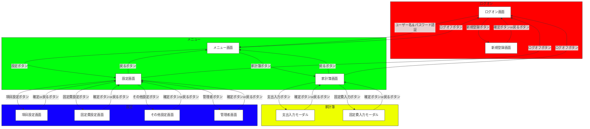

```mermaid

graph TD

    classDef default fill: #fff,stroke: #333,stroke-width: 1px;
    style funcA fill: #ff0000,stroke: #333,stroke-width: 1px;
    style funcB fill: #00ff0d,stroke: #333,stroke-width: 1px;
    style funcC fill: #eeff00,stroke: #333,stroke-width: 1px;
    style funcD fill: #1100ff,stroke: #333,stroke-width: 1px;

    subgraph funcA [ログオン]
        ログオン画面--新規登録ボタン-->新規登録画面--確定ボタンor戻るボタン-->ログオン画面
    end

    subgraph funcB [メニュー]
        メニュー画面--家計簿ボタン-->家計簿画面--戻るボタン-->メニュー画面
        メニュー画面--設定ボタン-->設定画面--戻るボタン-->メニュー画面
        ログオン画面--ユーザー名＆パスワード認証-->メニュー画面--ログオフボタン-->ログオン画面
    end

    subgraph funcC [家計簿]
        家計簿画面--支出入力ボタン-->支出入力モーダル--確定ボタンor戻るボタン-->家計簿画面
        家計簿画面--固定費入力ボタン-->固定費入力モーダル--確定ボタンor戻るボタン-->家計簿画面
        家計簿画面--ログオフボタン-->ログオン画面
    end

    subgraph funcD [設定]
        設定画面--項目設定ボタン-->項目設定画面--確定or戻るボタン-->設定画面
        設定画面--固定費設定ボタン-->固定費設定画面--確定ボタンor戻るボタン-->設定画面
        設定画面--その他設定ボタン-->その他設定画面--確定ボタンor戻るボタン-->設定画面
        設定画面--管理者ボタン-->管理者画面--確定ボタンor戻るボタン-->設定画面
        設定画面--ログオフボタン-->ログオン画面
    end
```